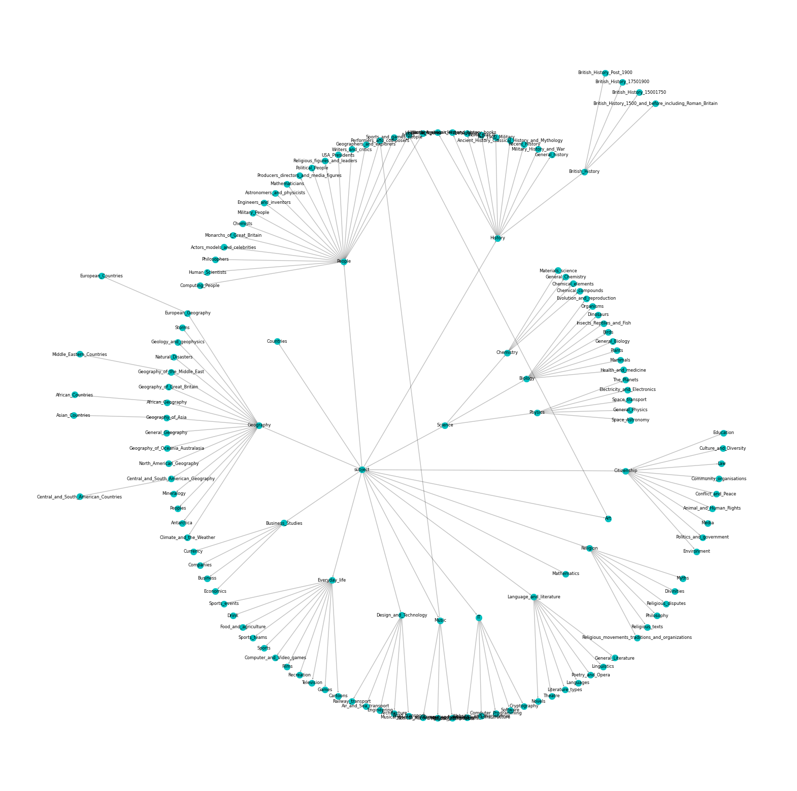
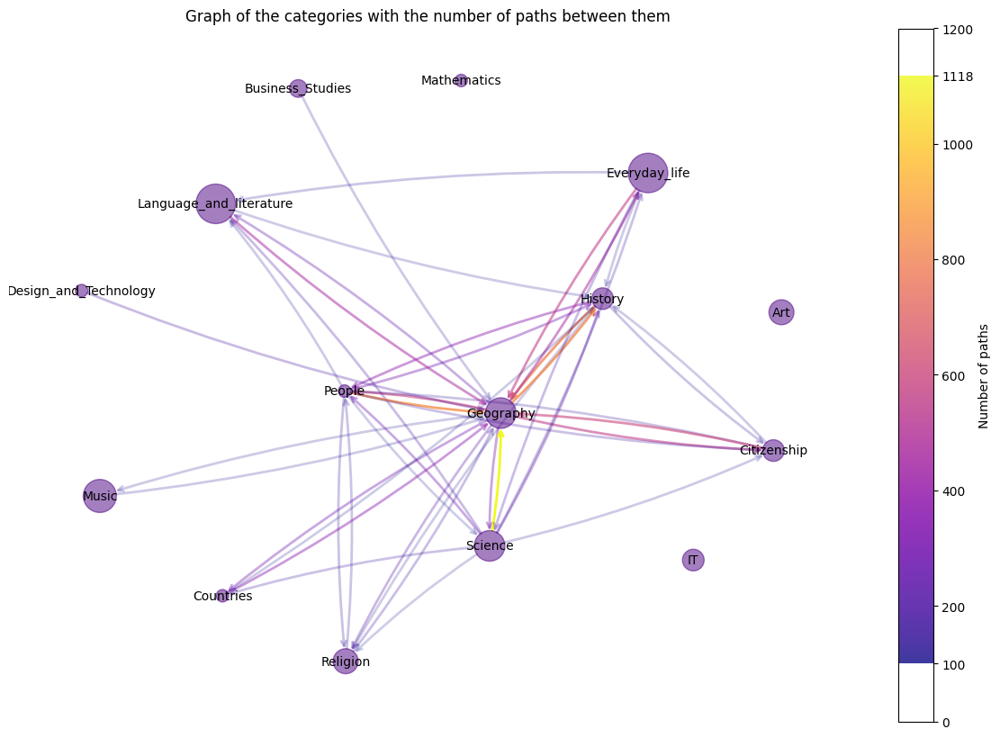
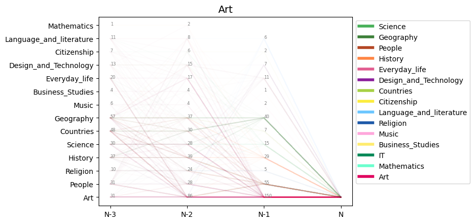
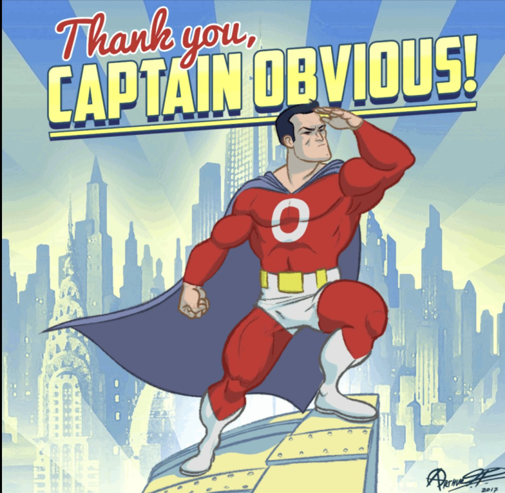
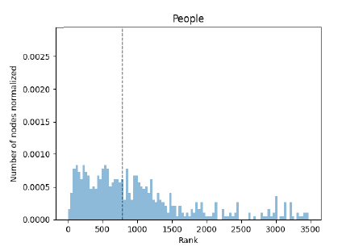
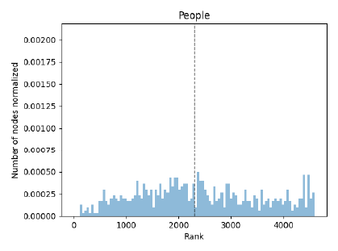
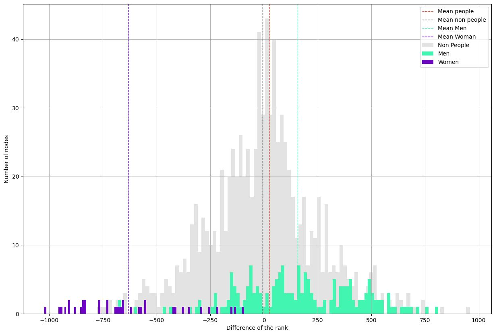

Have you ever wondered how many people you know? Well, the answer depends on what you mean by "knowing," and even like this, it’s not an easy question to answer. Quite a few scientists have tackled this question. Firstly, let’s consider the people you really know—the ones you could have a drink with when you cross them in the street. This question was answered in the 1990s by the British anthropologist Robin Dunbar. He linked the size of the primates’ brains to their ability to remember their peers. Given this, he concluded that we know around 150 people[^1]. 

But that seems rather small, right? Think about all the people you went to school with or all of your coworkers; that’s definitely more than 150. Then, let’s consider a new category. Can you tell me how many faces you remember? Whether it be your favourite singer, whom you never met but would definitely recognise, or the cashier you see every week at the supermarket but whose name you don’t know, these are all faces that you recognise in a crowd. In this case, studies showed that humans remember around 5,000 faces, which makes sense already[^2].

<iframe src="https://giphy.com/embed/3oEduNGzfmQkYtT916" align-items="center" display="block" width="350" height="350" frameBorder="0" class="giphy-embed" allowFullScreen></iframe>
<a href="https://giphy.com/gifs/suitsusanetwork-suits-donna-paulsen-3oEduNGzfmQkYtT916">via GIPHY</a>

And then there’s an even larger category, comprising all the names that you know: all your relatives, colleagues, neighbours, politicians, historical figures, artists, musicians, scientists, etc. Sadly, we didn’t find any studies that managed to determine this number.

Now let’s forget the people you really know and focus on those we might call celebrities—our stars. There are so many names that we know: the scientist whose theorem you studied in high school, the politician who made reforms in your country three years ago, or the athlete that you followed since primary school. Say you are a fan of Taylor Swift. You know so much about her: where she comes from, all her albums, her personal life, and the name of her cats. However, you’ve only ever vaguely heard about Napoleon and only know that he’s French. And then there’s that painter, Turner, and you only know that he was friends with Monet. Or Michelle Obama; you definitely know her because of her husband, but can you list anything that she accomplished?

Overall, we remember different people for different reasons. There are those whom we know everything about, those we learned about in school, those we know for what they did, where they lived, or who they knew. This is what we want to try and understand: how do we remember people?

# Wikispeedia and exploration of our data:
To answer our question, we used data from the Wikispeedia Game [^3] developed by the Data Science Lab (dLab), a research group at EPFL[^4]. The aim of this game is to navigate from one Wikipedia page to another using the links between them and create the shortest path you can. The number of articles available is only a fraction of the Wikipedia database. The choice of source and target articles is either randomly assigned by the game or chosen by the player.

To gain insights into how people are remembered, we studied the data and first started by looking into the different article categories. Each category is a grouping of sub-categories. Fig.1 is the representation of the three first sub-categories. We will refer to the first nodes of the category path as categories and the second nodes as sub-categories.

 Fig. 1 : Visualisation of the first three subcategories of all articles 

<iframe src="overall_dataset_bar.html" width="1100" height="530" frameborder="0" ></iframe>

Fig. 2 : Distribution of the first two subcategories.

The category that interests us the most is the People one. To compare it with others, we need a better overview of their distribution across all articles. We found out that only 14.7% of the articles are about people. Even so, this category still represents the third most prominent category (Fig. 2). However, not all articles are selected as targets. Within target articles, around 11.5% of them are people, which is close to the article distribution. Looking at the paths leading to those selected targets, 25.5% of the articles visited are People, which is lower than those of non-People (Fig. 3). This low proportion is not surprising given the distribution of People/non-People articles. Yet, somehow the proportion of people in paths almost doubles compared to the proportion of articles about people in Wikipedia.

<iframe src="Pie_paths_percentages.html" width="100%" height="400px" frameborder="0" position="relative"></iframe>

 Fig. 3 : People and non-People distribution, from left to right, within all articles, within all the paths, and within all the paths leading to a People target

# How can we analyse such a dataset?
A common way to play Wikispeedia is to first reach a general concept with many outgoing links, such as countries or topics related to geography (Fig.4), as fast as possible. Then, players narrow down the research on the subject to find articles as close as possible to the subject of the target. The first phase heavily depends on the source article, and the second phase on the target article[^5]. 

 Fig. 4 : Representation of the number of links between categories. The plot does not take into account the self-linking, and the categories that do not have enough linking numbers between them are not shown. It means, for example, that IT, Art and Mathematics mainly stay in their categories and that Geography is reached by a large number of other categories.

Due to these two observations, we will focus on the last three links before reaching the target. 

# What do these last three links tell us?
In Fig. 5, we can look at the category distribution of the three last steps for each finished path. We separated each plot according to the target category. The colours of the lines correspond to the category visited by the node (N-1) just before reaching the target. This colour choice allows us to notice, for example, that in Science for most of the paths, whatever the category in N-3, most of them finished in the Science category in N-1. Most of the targets are reached from articles of various categories, but there are some exceptions, such as for the Mathematics or Music targets, which mostly stay in their own categories, which is coherent with Fig.4.
	

<label for="plotSelectorPath">Select a category to plot:</label>
<select id="plotSelectorPath" onchange="loadPlotPath()">
    <option value="path/Art.png" >Art</option>
    <option value="path/Business_Studies.png" >Business & Studies</option>
    <option value="path/Citizenship.png" >Citizenship</option>
    <option value="path/Countries.png" >Countries</option>
    <option value="path/Design_and_Technology.png" >Design & Technology</option>
    <option value="path/Everyday_life.png" >Everyday Life</option>
    <option value="path/Geography.png" >Geography</option>
    <option value="path/History.png" >History</option>
    <option value="path/IT.png" >IT</option>
    <option value="path/Language_and_literature.png" >Language & Litterature</option>
    <option value="path/Mathematics.png" >Mathematics</option>
    <option value="path/Music.png" >Music</option>
    <option value="path/People.png" >People</option>
    <option value="path/Religion.png" >Religion</option>
    <option value="path/Science.png" >Science</option>
</select>

 Fig. 5 : The categories of the last three articles visited, grouped by target categories. Each line corresponds to a path, and its colour corresponds to the category visited by the path in N-1 a) People target: within the last links, all the categories are more or less used to reach the target.  b) History target: mainly comes from History articles or often closely related subjects such as Countries, Geography, People and Religion. c) Science target: almost all of the paths come from Science-related subjects.  d) Mathematics target: almost all of the paths come from Mathematics-related subjects.

# What about the People?
For the People target, the last links come from all categories (Fig. 5). However, the People-to-People last link is less used than other categories. Indeed, for the non-People target, the previous path stays at most in the same categories, while for People target, the most frequent previous link category is History, with People coming only in fourth. (Fig. 6).

	

<iframe  width="100%" height="530px"  id="plotFrame" frameborder="0" src="bar/path_bar_People.html"></iframe>

<label for="plotSelector">Select a category to plot:</label>
<select id="plotSelector" onchange="loadPlot()">
    <option value="bar/path_bar_Art.html" >Art</option>
    <option value="bar/path_bar_Countries.html">Countries</option>
    <option value="bar/path_bar_IT.html">IT</option>
    <option value="bar/path_bar_Business_Studies.html">Business & Studies</option>
    <option value="bar/path_bar_Citizenship.html">Citizenship</option>
    <option value="bar/path_bar_Design_and_Technology.html">Design & Technology</option>
    <option value="bar/path_bar_Everyday_life.html">Everyday Life</option>
    <option value="bar/path_bar_Geography.html">Geography</option>
    <option value="bar/path_bar_History.html">History</option>
    <option value="bar/path_bar_Language_and_literature.html">Language & Litterature</option>
    <option value="bar/path_bar_Mathematics.html">Mathematics</option>
    <option value="bar/path_bar_Music.html">Music</option>
    <option value="bar/path_bar_People.html">People</option>
    <option value="bar/path_bar_Religion.html">Religion</option>
    <option value="bar/path_bar_Science.html">Science</option>
</select>

 Fig. 6 : Distribution of the N-3 articles leading to a target in people (change target in selection box). The count per step was normalised by the total number of articles in each category. 

This distinction between People and non-People may be related to their sub-categories. In comparison to those of non-People that remain in the same genre as their respective categories, the sub-categories of People vary a lot. There are 20 sub-categories of People (Fig. 6). As we can observe, the biggest sub-categories (Historical figures) can be associated with History, the most represented last article’s category before the path ends in People. 

<iframe src="people_categories.html" width="100%" height="530px" frameborder="0" position="relative">Genre plot</iframe>

 Fig. 7 : Distribution of People first subcategories

Based on the results above, we concluded that, to access a target of a certain category, players tend to reach it using other articles within the same categories, even when those categories are less represented, such as Music, Religion, or Art (Fig. 2). This trend is particularly evident in certain categories, such as Science, where almost all the preceding links are also within the science domain. In other cases, it is less obvious, as for History, where many categories lead to it, but history remains the dominant one. However, these paths exhibit a similar tendency. The only exception is observed for the People target, as mentioned earlier. This suggests that, contrary to our initial assumption about our research question, individuals are not remembered for their social circles but rather for their achievements. This is indicated by the fact that they are frequently reached through links associated with other subcategories rather than through other People.
 

# Can we find out People’s fame with our dataset? 

We did a lot of counting, but a count isn't perfect to really affirm a global trend. Indeed, imagine there are 550 people trying to find Hitler's page [^7], then one would expect that most of the player's path's penultimate page will be World War 2 (WW2). But now let's imagine that:
 
- 250 layers went from the “WW2” page to find it
- 100 players went from the “Germany” page to find it
- 100 players went from the “Austria” page to find it  
- 50 players went from the “Poland” page to find it
- 50 players went from the “France” page to find it
 
If you now count the different categories, you will find that 250 pages have the category History and 300 pages have the category Country which would mislead us into believing he is famous for where he came from. When the truth actually is that he is most known for what he did and not for where he came from.
 
How can one resolve this problem and devise a kind of ranking for the pages?
 
Use PageRank ! 

The idea of PageRank is that the most important node in a directed graph is the node that is pointed to by the most “important” nodes. 
So, by taking all the paths that players took while trying to find a People page, putting them into a graph, and then running the pagerank algorithm on this graph, you get the most important node in the players' paths, which is... the United States!
 
Ok, that's cool, but it doesn’t tell us much about our research question.
 
Let's not just look at the first place and look at the distribution of rank in each category.

<label for="plotSelectorRank">Select a category to plot:</label>
<select id="plotSelectorRank" onchange="loadPlotRank()">
    <option value="rank_cat/art.png" >Art</option>
    <option value="rank_cat/business.png" >Business & Studies</option>
    <option value="rank_cat/citizenship.png" >Citizenship</option>
    <option value="rank_cat/countries.png" >Countries</option>
    <option value="rank_cat/design.png" >Design & Technology</option>
    <option value="rank_cat/everyday.png" >Everyday Life</option>
    <option value="rank_cat/geography.png" >Geography</option>
    <option value="rank_cat/history.png" >History</option>
    <option value="rank_cat/it.png" >IT</option>
    <option value="rank_cat/language.png" >Language & Litterature</option>
    <option value="rank_cat/mathematics.png" >Mathematics</option>
    <option value="rank_cat/music.png" >Music</option>
    <option value="rank_cat/people.png" >People</option>
    <option value="rank_cat/religion.png" >Religion</option>
    <option value="rank_cat/science.png" >Science</option>
</select>

 Fig. 8 : Distribution of the rank of each category. This ranking was calculated using PageRank on all the paths that players took while trying to find a People page.

That's way more interesting! We can now say that the most important category in the paths that players took is the people category. That contradicts what we have found before, but is more to be expected when you think about how people would play the game.
We could now say that the player tends to search for People by looking at other Peoples and therefore People are more known for who they know. 
 
But that would be a bit too easy, and we want to deepen the analysis a bit. The rest of the categories seem very similar, with the mean being pretty much in the middle of the ranks.
But maybe this importance rank changes as we approach the target nodes?
Indeed, we see in Fig.9 that the distribution of the categories of the starting nodes is not uniform at all, with History and Geography being way more represented. This could induce a bias, as by starting with a country, one might stick with countries for 2-3 jumps before jumping into a new category, and therefore the importance of countries is artificially high in the beginning of the paths but dies down as we approach the target.

<iframe src="start_cat.html" width="100%" height="530px" frameborder="0" position="relative">Genre plot</iframe>

 Fig. 9 : AAAAAAAAAAAAAAAAAAAAAAAAAAAAAAAAAAAAAAAAAAAAAAAAAAAAAAAAAAAAAAAAAAAAAAAAAAAAAAA

So let's now compute the pagerank on the graph where only the target - n paths are added. 

For example, if n = 2 and we have the path “Computer → Jesus → Pikachu → France → Gay Pride,” with Gay Pride being the target, then the path taken and added to the graph would be “Jesus → Pikachu → France."
If n = 1, the path added would be “Pikachu → France."

Note that we never add the path “France → Gay Pride“ as we don’t want to deal with the disparity of the targets, and the targets will all be people, and this would totally ruin our analysis.
Let’s do that for every path that has a People as a target. We take only the n jumps preceding the target, graph them, rank them using pagerank, and take the median of the rank of each category. This gives us a way to compare each category and see which one is more important before arriving at the target.

By doing it for n from 1 to 7 and graphing the medians depending on n, we find the following graph. To understand this graph, you just have to remember two things: the smaller n is, the nearer you are reaching the target, and the more the normalised rank goes to 0, the more important you are, so the lower lines the more important the category is.

<iframe style="zoom: 0.75; -moz-transform: scale(0.75); -moz-transform-origin: 0 0; -o-transform: scale(0.75); -o-transform-origin: 0 0;  -webkit-transform: scale(0.75); -webkit-transform-origin: 0 0;" src="line_rank.html" width="200%" height="700px" frameborder="0" position="relative">Genre plot</iframe>

 Fig. 10 : Graph of the evolution of category’s median ranks through the players’ paths

The importance of the People category is even clearer than in the previous graph; we clearly see that the People category is more important at the beginning, middle, and end of paths taken by the players. And we can really affirm that People are more known by the general public for who they know than for what they do. 

We also see the dip in importance of the Art category between the n-3 jump and the final jump; we don’t know how to explain that, and further analysis would be needed.

Finally, we also remark that the Country category is way less important in this analysis than in our counting analysis. Maybe it is because there are a lot of different countries, and if a celebrity or historical figure did significant things in multiple countries, then they can be reached from multiple countries' Wikipedia pages. This dilutes the paths to countries, and countries are less important in the pagerank. In a way this shows the caveat of this analysis, we will explain it with an example: We take the same example with Hitler but this time:

- 150 players went from the “Germany” page to find him
- 100 players went from the “War” page to find him
- 100 players went from the “Nazi” page to find him  
- 50 players went from the “WW2” page to find him
- 50 players went from the “Invasion” page to find him

Is Hitler here really known for WW2 or for his links with Germany? His pagerank will tell us he is known for his link with Germany…

 (Note: For simplicity, we omit the fact that page rank would also take into account the number and importance of the nodes pointing to Germany, War..)

This caveat could then explain the difference between the counting and pagerank analyses.

It is important to see that this pagerank analysis doesn’t completely cancel the counting analysis done beforehand, but it comes as a complement.
The counting analysis states that people are in general known by what they did, and it shows the disparity of knowledge among the players. One could argue that if all the players came together, they would be able to state everything that a person did, and it shows in a way that the population never forgets.
The pagerank analysis, on the other hand, states that a large portion of the players know most of the targets based on who they interacted with. Yes, the targets did a lot of things, but it is easier to both remember and find the person related to the target than what they achieved. Most of the players even went through the same People page to find their common target, which shows how important this People is in the path. 
We also see that the Countries are really important in the Wikipedia architecture as they are related to most of the pages and have by far the biggest pagerank (Fig. 11), but in the paths they are not important. This consolidates the fact that the People category is important because, even with Countries being very present (and so a lot of occasions for the players to find their target via the Countries), the People category came in at the top. 

<label for="plotSelectorRank2">Select a category to plot:</label>
<select id="plotSelectorRank2" onchange="loadPlotRank2()">
    <option value="rank_cat2/art.png" >Art</option>
    <option value="rank_cat2/business.png" >Business & Studies</option>
    <option value="rank_cat2/citizenship.png" >Citizenship</option>
    <option value="rank_cat2/countries.png" >Countries</option>
    <option value="rank_cat2/design.png" >Design & Technology</option>
    <option value="rank_cat2/everyday.png" >Everyday Life</option>
    <option value="rank_cat2/geography.png" >Geography</option>
    <option value="rank_cat2/history.png" >History</option>
    <option value="rank_cat2/it.png" >IT</option>
    <option value="rank_cat2/language.png" >Language & Litterature</option>
    <option value="rank_cat2/mathematics.png" >Mathematics</option>
    <option value="rank_cat2/music.png" >Music</option>
    <option value="rank_cat2/people.png" >People</option>
    <option value="rank_cat2/religion.png" >Religion</option>
    <option value="rank_cat2/science.png" >Science</option>
</select>

 Fig. 11 : Distribution of the rank of each category. This ranking was calculated using PageRank on the network created by the links in the pages (Exactly what PageRank was created to do: rank pages).

# Is this fact true for both men and women?

In our article selection, the same tendency of women under representation as for the whole Wikipedia database[^6] is observed: the number of women is very low, which provides us with a really unbalanced dataset (Fig. 12). Notice that in the People selection, there are some unknown gender labels as groups of people, such as the Grimm brothers, or some ungendered characters, such as Pikachu.

As any good story starts, first we need the data. So let’s dig a little deeper and have a look at the repartition of men and women in our dataset (Fig.12). And the results hurt a lot, with a huge over-representation of men. While wikipedia still has some work to do on gender equality, that’s not the point here. Overall we have 689 people, with 87% of men and 9% of women, with men dominating all categories except ‘Actors, models and celebrities’. 

A quick look at the starting articles from the paths gives the approximate same distribution, but a slightly slower percentage of women in the end articles (Fig 11). This can be explained by the fact that players are allowed to choose their final target.

<iframe src="pie_gender_start_finish.html" width="100%" height="530px" frameborder="0" position="relative">Genre plot</iframe>

 Fig. 12 : Gender distribution in the paths, for the a) Start articles b) Target articles

<iframe src="overall_categories_gender.html" width="100%" height="530px" frameborder="0" position="relative">Genre plot</iframe>

 Fig. 13 : Distribution of people first subcategories by gender

Now let’s look at these path bar plots we saw earlier a little more in detail (Fig 13). Firstly, between men and women, we notice that the ‘People’ arrives for both categories around the middle of the ranking, thus reinforcing that counts aren’t fool proof. However, we do notice that people count more for women than men. 

If we saw you reading this right now, we would expect you to look like this : 

<a href="https://tenor.com/view/sheldon-cooper-why-gif-7590449">Sheldon Cooper GIF</a>from <a href="https://tenor.com/search/sheldon-gifs">Sheldon GIFs</a>
 

Yes, the categories are so unevenly distributed between men and women that this analysis is not really pertinent. So we will rather study the ‘Actors, models and celebrities’ gender split. And in this specific case, ‘People’ does rank significantly higher for women than men, insisting the existence of a bias.

<iframe  id="plotFrameGender" width="100%" height="530px" frameborder="0" src="bar/path_bar_women.html"></iframe>

<label for="plotSelectorGender">Select a category to plot:</label>
<select id="plotSelectorGender" onchange="loadPlotGender()">
    <option value="bar/path_bar_women.html">Women</option>
    <option value="bar/path_bar_men.html">Men</option>
    <option value="bar/path_bar_actors, models and celebrities.html" >Actors, Models and celebrities (both genders)</option>
    <option value="bar/path_bar_female actors.html">Actors, Models and celebrities (Women)</option>
    <option value="bar/path_bar_male actors.html">Actors, Models and celebrities (Men)</option>
</select>

 Fig. 14 : Distribution of the N-3 articles leading to a target in people (change sub-category in selection box). The count per step was normalised by the total number of articles in each category

# Let's Page Rank these gender differences  

The counting analysis gave us some insight on the gender differences but it only looked at one sub-category as it was the only one which was balanced, therefore the only one  giving accurate and comparable results.

With pagerank, we can avoid the target disparity problem and be more general with our conclusions.
To do so, we create two graphs, one containing the paths where the target nodes are women (we call it the women's paths network) and the other where the target nodes are men (the men's paths network). This creates distinct graphs; we can then find two independent rankings for those graphs and then look at the difference between the two rankings.
Are people better ranked in the women's graph and therefore more important than in the men's graph? Or is it the opposite?

We have done this, and these are the results (Fig. 15). The plot is a bit complicated to understand, but it was made to really show the difference in rank between the two graphs.
This plot shows the difference in ranking (and, therefore, importance) of the different pages between the women's paths network and the men's paths network.
 We can see in grey the difference in ranking of all the pages that are not about people; it makes a nice normal distribution. Some pages are more important than others, but the mean is pretty much 0.
 Next to this non-People mean, we have the mean of the differences in rank for the People pages. There is a slight augmentation in rank between the women's paths network and the men's paths network, but nothing significant.

Now what this graph really shows us is the difference between men and women. It is pretty staggering how the entirety of the pages about women lose on average 630 places between the women's paths network and the men's paths network, and how men gain on average only 157 places between the two networks.

# What does that mean ?

It means that when players are looking for a male target they rarely go through women wikipedia pages, and they consult them way less than if they were looking for a woman. On the other hand when people are trying to find women targets they tend to pass less by men pages than if they were looking for a man but the difference is smaller. 

This disparity is surprising in the way it affects way more the ranking of women than men.

What we get from this graph is that there is a strong imbalance and women tend to be equally known by their men or women frequentations and the men are almost only known by their men frequentations. 

 Fig. 15 : Difference of rank between the women's paths network and the men’s path network, a node that gained rank in the men’s path network compared with his ranking in the women’s path network would be on the right of the 0 

# Conclusion and limitations
Overall, People targets are more reached via category articles than via a social circle. However, does that mean we remember them more by their achievement? Not necessarily. In fact, in this analysis, there are many biases to consider. 

First of all, as mentioned above, the Wikispeedia game is based on only a fraction of the Wikipedia database. Maybe this reduction in the number of articles introduced a bias of selection. Furthermore, since the players can choose the source-target pairs, they tend to choose articles they know more about which do not reflect the common knowledge everybody will have about the celebrities. Also, it may be that the way the articles are constructed influences the choice of the players since lots of them want to play as fast as possible. Do short articles lead to wiser choices? Do people prefer to select links that are on a table summary, on a paragraph at the top of the page, or on a legend of an image? 

Lastly, something we must not forget is that Wikispeedia is a game. As for all games, some strategies are made to reach the goal more efficiently, so it might be a huge influence on the choice made by the players. Hence, people within this article selection are not reached through their social circle. They tend to be more selected by the domained they are known for. 

Then regarding gender bias, through our analysis of the paths and their obtained PageRank we discovered that there is indeed a bias when choosing the links to follow in the game’s article. Indeed, to find a women’s page, the player will tend to pass by both men and women's pages, while to find a man’s page, it’s rare for the player to go through a woman’s page. 
As a final word, bad news : you should rather not show this to girls around the world as it doesn’t really show a good image of women and their recognition. But good news : you will be remembered for your accomplishments and not your famous best friend. So, if you have some free time on a weekend, don’t hesitate to write a page about a famous woman, and let’s break down this digital gender inequality.

### References
[^1]: ‘Dunbar’s number’, Wikipedia. Dec. 18, 2023. Accessed: Dec. 18, 2023. [Online]. Available: [https://en.wikipedia.org/w/index.php?title=Dunbar%27s_number&oldid=1190501720](https://en.wikipedia.org/w/index.php?title=Dunbar%27s_number&oldid=1190501720)
[^2]: R. Jenkins, A. J. Dowsett, and A. M. Burton, ‘How many faces do people know?’, Proc. R. Soc. B Biol. Sci., vol. 285, no. 1888, p. 20181319, Oct. 2018, doi: 10.1098/rspb.2018.1319.
[^3]: ‘Wikispeedia’. Accessed: Dec. 18, 2023. [Online]. Available: [https://dlab.epfl.ch/wikispeedia/play/](https://dlab.epfl.ch/wikispeedia/play/)
[^4]: E. D. S. Lab, ‘Data Science Lab’, dlab @ EPFL. Accessed: Dec. 18, 2023. [Online]. Available: [http://dlab.epfl.ch/](http://dlab.epfl.ch/)
[^5]: R. West, ‘Wikispeedia: An Online Game for Inferring Semantic Distances between Concepts’.
[^6]: ‘Wikipedia:WikiProject Women in Red’, Wikipedia. Dec. 14, 2023. Accessed: Dec. 18, 2023. [Online]. Available: [https://en.wikipedia.org/w/index.php?title=Wikipedia:WikiProject_Women_in_Red&oldid=1189903435](https://en.wikipedia.org/w/index.php?title=Wikipedia:WikiProject_Women_in_Red&oldid=1189903435)
[^7]: The godwin point has been reached.[https://en.wikipedia.org/wiki/Godwin%27s_law#:~:text=Godwin's%20law%2C%20short%20for%20Godwin's,Nazis%20or%20Hitler%20approaches%201.%22](Wikipedia - Godwin's law)

